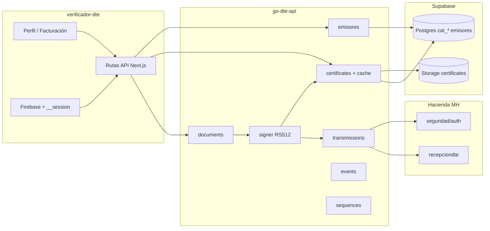
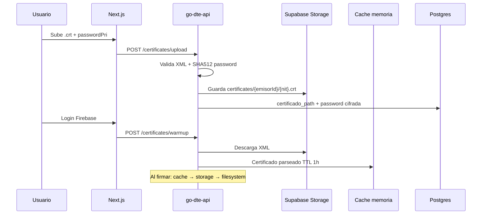
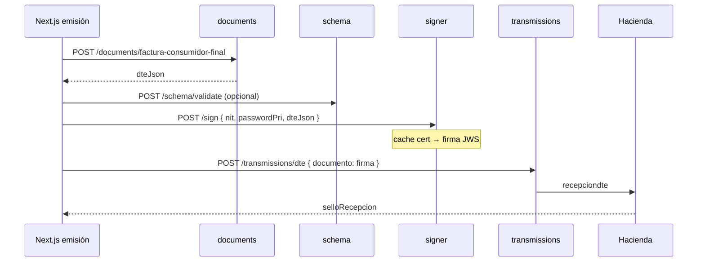

# Estrategia: API DTE según manuales Hacienda v2

Documento de referencia para alinear **verificador-dte (Next.js)**, **go-dte-api (Go)** y **Supabase Postgres/Storage** con los manuales oficiales del Ministerio de Hacienda de El Salvador.

Complementa [`PLAN_FACTURACION_GO.md`](PLAN_FACTURACION_GO.md) (firmador y certificados) y el plan de implementación acordado en Cursor.

---

## 1. Objetivo

Construir un pipeline de facturación electrónica **correcto, rápido y mantenible**:

1. Datos de emisor/receptor validados contra catálogos MH (CAT-005/006/008).
2. Certificados `.crt` en Supabase Storage con cache en servidor para firmar sin leer disco en cada DTE.
3. Generación, validación, firma JWS RS512 y transmisión a Hacienda desde Go.
4. Eventos normativos (invalidación, contingencia, operaciones especiales, retorno).
5. Tipos DTE faltantes (04, 07, 08, 09, 15) y correlativos atómicos.

---

## 2. Fuentes normativas revisadas

| Documento | Ubicación | Uso en la estrategia |
|-----------|-----------|----------------------|
| Manual Funcional Sistema de Transmisión v2.0 | `Documentacion de hacienda/Manual Funcional del Sistema de Transmisión V 2.0 (3).pdf` | Tipos DTE, eventos VII–X, plazos invalidación, `numeroControl`, campos emisor |
| Manual Técnico Integración v2 | `Documentacion de hacienda/Manual Técnico para la Integración Tecnológica del Sistema de Transmisión v2 (3).pdf` | Endpoints MH (PDF escaneado; URLs tomadas de README y `.env.example`) |
| Catálogos FE | `Documentacion de hacienda/Catálogos- Facturación Electrónica (3).pdf` | CAT-001 a CAT-033 (PDF escaneado; datos en `scripts/init-db.sql`) |

**Brecha documental:** los PDF escaneados no permiten OCR fiable. Para validación estricta falta incorporar al repo la carpeta `svfe-json-schemas` referenciada en `PLAN_FACTURACION_GO.md`.

---

## 3. Arquitectura objetivo



### División de responsabilidades

| Capa | Responsabilidad |
|------|-----------------|
| **Next.js** | Auth Firebase, UI emisor/receptores, orquestación de emisión (armar payload, guardar emisiones), proxy a Go |
| **go-dte-api** | Generar JSON DTE, validar estructura, firmar, transmitir, consultar, eventos, correlativos |
| **Postgres** | Catálogos MH, `emisores`, `clientes`, `emisor_configuracion`, `dte_control_sequences` |
| **Supabase Storage** | Archivos `.crt` (XML CertificadoMH), bucket privado `certificates` |

---

## 4. Matriz: requisito MH vs implementación

| Área | Requerido MH | Estado |
|------|--------------|--------|
| DTE 01, 03, 05, 06, 11, 14 | Generar + transmitir | Implementado E2E vía Next (ambiente test y prod según `ambiente_codigo`) |
| DTE 04, 07, 08, 09, 15 | Estructuras propias | Go: endpoints + dominios base; Next/UI sin rutas de emisión dedicadas |
| `recepciondte` / `recepcionlote` | Transmisión | Go: `transmissions` |
| `consultadte` / `consultadtelote` | Consulta | Go: `queries` |
| Auth `seguridad/auth` | Token Bearer | Go: `POST /api/facturacion/hacienda/auth` + Next.js `hacienda-auth` |
| Certificado XML | Subir, validar, firmar | Go: `certificates` + Storage; UI en `/configuraciones` (`CertificateSettingsCard`) |
| Emisor persistente | NIT, dirección, actividad | Postgres + Go `emisores` + Next `profile/emisor`; BFF usa `GET /api/emisores/me/dte-input` |
| CAT-005/006/008 | Ubicación 2 dígitos | Validación estricta en `resolve-location.ts` (400 si no existe en catálogo) |
| Eventos invalidación/contingencia/op. especiales/retorno | JSON evento + firma + TX | Go: `events/*/submit` + rutas Next proxy; reglas de plazo pendientes de codificar |
| JSON Schema oficial | Pre-firma | Go: `schema/validate` + `svfe-json-schemas/` (estructural + schemas por tipo) |
| Correlativos `numeroControl` | Secuencial atómico | **Crítico:** Go `sequences/next` integrado en rutas Next; `cod_estable`/`cod_punto_venta` en `emisor_configuracion` |
| Exportación 11 | Receptor/items extranjero | Go: `receptors` + `items` export |
| Auth/hardening Go | Solo BFF autorizado | Middleware `X-Go-Dte-Internal-Key` en `/api/facturacion/*`; signer usa password cifrada en Postgres |
| Contingencia en DTE | `tipoContingencia`, `motivoContin` | Pendiente en generadores |
| 2026: terceros, fusiones, tributos | Campos nuevos | Pendiente |

---

## 5. Fases de ejecución (orden acordado)

### Fase 1 — Ubicación y emisor (crítico)

**Problema:** mezcla de esquemas 4 dígitos vs 2 dígitos, distritos incompletos, fallback silencioso al emitir, labels de ambiente invertidos en UI.

**Acciones:**

1. Ejecutar en Supabase (en orden):
   - [`scripts/fix-ubicacion-v2.sql`](scripts/fix-ubicacion-v2.sql)
   - [`scripts/fix-cat-013-tipo-dte.sql`](scripts/fix-cat-013-tipo-dte.sql)
   - [`scripts/seed-distritos-default.sql`](scripts/seed-distritos-default.sql)
2. Verificar datos: [`scripts/verify-ubicacion-emisores.sql`](scripts/verify-ubicacion-emisores.sql)
3. Código Next.js:
   - [`verificador-dte/lib/facturacion/resolve-location.ts`](verificador-dte/lib/facturacion/resolve-location.ts) — validación contra catálogos
   - [`verificador-dte/lib/facturacion/build-emisor.ts`](verificador-dte/lib/facturacion/build-emisor.ts) — emisión unificada
   - [`verificador-dte/app/api/profile/emisor/route.ts`](verificador-dte/app/api/profile/emisor/route.ts) — guardado + `emisor_configuracion`
   - [`verificador-dte/components/profile/EmitterSettingsForm.tsx`](verificador-dte/components/profile/EmitterSettingsForm.tsx) — ambiente y distrito

**Regla de negocio:** si `(departamento, municipio, distrito)` no existe en catálogo → **400**, nunca sustituir distrito por el primero del municipio.

---

### Fase 2 — Módulo emisores en Go

**Objetivo:** una sola fuente de verdad para `EmisorInput` al generar DTE.

| Método | Ruta | Descripción |
|--------|------|-------------|
| GET | `/api/emisores/me` | Emisor por `firebase_uid` (header `X-Firebase-UID`) |
| GET | `/api/emisores/me/dte-input` | Payload listo para Go `documents` |
| GET | `/api/emisores/:id/dte-input` | Por ID emisor |

Código: [`go-dte-api/internal/modules/emisores/`](go-dte-api/internal/modules/emisores/)

**Siguiente paso recomendado:** que las rutas Next de facturación llamen `GET /api/emisores/me/dte-input` en lugar de duplicar SQL.

---

### Fase 3 — Certificados Supabase + cache de sesión

**Decisión de seguridad:** la clave privada **no** va en cookie del navegador. Cache solo en **memoria del proceso Go** (TTL configurable), precargada al login.



| Componente | Ruta / archivo |
|------------|----------------|
| Upload Go | `POST /api/facturacion/certificates/upload` |
| Warmup Go | `POST /api/facturacion/certificates/warmup` |
| Proxy Next upload | [`verificador-dte/app/api/facturacion/certificates/upload/route.ts`](verificador-dte/app/api/facturacion/certificates/upload/route.ts) |
| Proxy Next warmup | [`verificador-dte/app/api/facturacion/certificates/warmup/route.ts`](verificador-dte/app/api/facturacion/certificates/warmup/route.ts) |
| Login hook | [`verificador-dte/components/AuthProvider.tsx`](verificador-dte/components/AuthProvider.tsx) |
| Signer | [`go-dte-api/internal/modules/facturacion/signer/signer.service.go`](go-dte-api/internal/modules/facturacion/signer/signer.service.go) |

**Variables de entorno** (ver [`go-dte-api/.env.example`](go-dte-api/.env.example)):

```env
SUPABASE_URL=
SUPABASE_SERVICE_ROLE_KEY=
SUPABASE_CERTIFICATES_BUCKET=certificates
HACIENDA_CREDENTIALS_ENCRYPTION_KEY=
HACIENDA_CERTIFICATE_CACHE_TTL=3600
```

**Pre-requisito Supabase:** crear bucket privado `certificates` (sin acceso público).

---

### Fase 4 — API normativa faltante

#### 4.1 Alta prioridad (emisión correcta)

| Módulo | Endpoint | Archivo |
|--------|----------|---------|
| Auth MH | `POST /api/facturacion/hacienda/auth` | `facturacion/auth/` |
| Schema | `POST /api/facturacion/schema/validate` | `facturacion/schema/` |
| Export 11 | `POST /api/facturacion/receptors/build` + `items/build` | `receptors`, `items` |
| Emisor Go | Validación dept/muni en `validateEmisor()` | `documents/documents.service.go` |

#### 4.2 Eventos (Manual Funcional VII–X)

| Evento | Endpoint |
|--------|----------|
| Invalidación | `POST /api/facturacion/events/invalidation` |
| Contingencia | `POST /api/facturacion/events/contingency` |
| Operaciones especiales | `POST /api/facturacion/events/special-operations` |
| Retorno | `POST /api/facturacion/events/return` |

Flujo por evento: **generar JSON → validar → firmar → transmitir** (reutilizar `transmissions`).

Reglas de invalidación a codificar (manual 2026):

- FE / FEXE / FSEE: fecha evento hasta 3 meses después de generación del DTE.
- CCF / NCE / NDE / etc.: plazo 10 días hábiles del mes siguiente al sello de recepción.
- Campos obligatorios: nombre, tipo y número de documento del responsable.
- No invalidar CCF si tiene NC/ND validadas (invalidar notas primero).

#### 4.3 Tipos DTE adicionales

| tipoDte | Documento | Endpoint Go |
|---------|-----------|-------------|
| 04 | Nota de remisión | `POST /api/facturacion/documents/nota-remision` |
| 07 | Comprobante retención | `POST .../comprobante-retencion` |
| 08 | Comprobante liquidación | `POST .../comprobante-liquidacion` |
| 09 | Doc. contable liquidación | `POST .../documento-contable-liquidacion` |
| 15 | Comprobante donación | `POST .../comprobante-donacion` |

**Nota:** los generadores actuales reutilizan estructura CCF como base. Cuando existan schemas oficiales, crear `domain/` específico por tipo.

---

### Fase 5 — Correlativos (prioridad crítica pre-producción)

**Bloqueante normativo:** sin `sequences/next` el `numeroControl` no cumple formato MH (`DTE-{tipo}-M{est}P{pto}-{15 dígitos}`).

1. Ejecutar [`go-dte-api/db/dte-sequences-schema.sql`](go-dte-api/db/dte-sequences-schema.sql) en Supabase.
2. Antes de generar DTE, llamar `POST /api/facturacion/sequences/next`:

```json
{
  "emisorId": 1,
  "nit": "06141812151015",
  "tipoDte": "01",
  "establecimiento": "001",
  "puntoEmision": "001"
}
```

Respuesta incluye `numeroControl` formato `DTE-{tipo}-M{est}P{pto}-{15 dígitos}`.

3. Persistir en `emisor_configuracion`: `cod_estable`, `cod_punto_venta`, tipo establecimiento (M/B/S/P).

---

## 6. Pipeline de emisión (flujo completo)



---

## 7. Catálogo CAT-013 (tipos DTE oficiales)

Corregido en [`scripts/init-db.sql`](scripts/init-db.sql) y [`scripts/fix-cat-013-tipo-dte.sql`](scripts/fix-cat-013-tipo-dte.sql):

| Código | Documento |
|--------|-----------|
| 01 | Factura consumidor final |
| 03 | Comprobante crédito fiscal |
| 04 | Nota de remisión |
| 05 | Nota de crédito |
| 06 | Nota de débito |
| 07 | Comprobante de retención |
| 08 | Comprobante de liquidación |
| 09 | Documento contable de liquidación |
| 11 | Factura exportación |
| 14 | Factura sujeto excluido |
| 15 | Comprobante de donación |

---

## 8. Checklist de despliegue

### Base de datos (Supabase SQL)

- [ ] `scripts/init-db.sql` (si base nueva)
- [ ] `scripts/fix-emisores-clientes.sql` o esquema transaccional vigente
- [ ] `scripts/fix-ubicacion-v2.sql`
- [ ] `scripts/fix-cat-013-tipo-dte.sql`
- [ ] `scripts/seed-distritos-default.sql`
- [ ] `go-dte-api/db/dte-sequences-schema.sql`
- [ ] `scripts/verify-ubicacion-emisores.sql` (revisar filas inválidas)

### Supabase Storage

- [ ] Bucket `certificates` (privado)
- [ ] Políticas: solo service role desde Go

### go-dte-api `.env`

- [ ] `SUPABASE_DB_URL`
- [ ] `SUPABASE_URL` + `SUPABASE_SERVICE_ROLE_KEY`
- [ ] `HACIENDA_CREDENTIALS_ENCRYPTION_KEY`
- [ ] `GO_DTE_INTERNAL_API_KEY` (mismo valor en verificador-dte)

### verificador-dte

- [ ] `GO_DTE_API_URL`
- [ ] `DATABASE_URL` / `SUPABASE_DB_URL`
- [ ] Usuario completa perfil emisor (dept/muni/distrito validados)
- [x] Subir certificado `.crt` desde UI (`/configuraciones` → `CertificateSettingsCard`)
- [ ] Correlativos: `cod_estable` / `cod_punto_venta` en perfil emisor + `sequences/next` activo
- [ ] `GO_DTE_INTERNAL_API_KEY` configurado en Go y verificador-dte (rutas facturación protegidas)

---

## 9. Riesgos y mitigaciones

| Riesgo | Mitigación |
|--------|------------|
| CAT-008 distritos incompleto | `seed-distritos-default.sql` pone distrito `01` por municipio; importar catálogo oficial completo |
| PDFs escaneados | Obtener manuales con texto o schemas JSON en repo (`svfe-json-schemas/`) |
| Generadores 04/07/08/09/15 simplificados | Iterar con schemas MH y pruebas en ambiente 01 (pruebas) |
| Cache cert en memoria se pierde al reiniciar Go | Warmup automático al login; opcional Redis después |
| Password cert en Postgres | Cifrado AES-GCM; signer resuelve desde DB si no llega `passwordPri` |
| Rutas Go `/api/facturacion/*` expuestas | Middleware `X-Go-Dte-Internal-Key`; Next.js como único cliente autorizado |
| `GO_DTE_INTERNAL_API_KEY` vacío | Falla de arranque o rechazo 401; nunca dejar key vacía en producción |
| Correlativo ad-hoc (`Date.now()`) | Integrar `POST /sequences/next` antes de emitir (Fase 5) |

---

## 10. Pendientes recomendados (post-implementación base)

1. ~~UI para subir `.crt` en Configuraciones~~ — hecho (`CertificateSettingsCard`).
2. ~~Integrar `sequences/next` en rutas de emisión Next.js~~ — hecho; verificar `dte-sequences-schema.sql` en Supabase.
3. ~~Copiar `svfe-json-schemas` al repo~~ — hecho en `go-dte-api/schemas/svfe-json-schemas/`; ampliar con schemas oficiales MH.
4. Validación catálogos en Go (`codActividad`, `uniMedida`, `formaPago`) contra `cat_*`.
5. ~~Dominios JSON separados para DTE 04, 07, 08, 09, 15~~ — dominios base en Go; iterar con schemas MH.
6. Campos 2026: venta/compra terceros, fusiones, contingencia en identificación.
7. ~~Eventos `events/*/submit` → firmar → `transmissions/dte`~~ — hecho en Go + proxy Next; codificar reglas de plazo invalidación.
8. Reglas de invalidación 2026 (plazos FE/CCF, NC/ND previas) en validador de eventos.

---

## 11. Referencia rápida de endpoints Go (facturación)

```
POST /api/facturacion/certificates/upload
POST /api/facturacion/certificates/warmup
POST /api/facturacion/hacienda/auth
POST /api/facturacion/schema/validate
POST /api/facturacion/sequences/next
POST /api/facturacion/events/invalidation
POST /api/facturacion/events/invalidation/submit
POST /api/facturacion/events/contingency
POST /api/facturacion/events/contingency/submit
POST /api/facturacion/events/special-operations
POST /api/facturacion/events/special-operations/submit
POST /api/facturacion/events/return
POST /api/facturacion/events/return/submit
POST /api/facturacion/documents/nota-remision
POST /api/facturacion/documents/comprobante-retencion
POST /api/facturacion/documents/comprobante-liquidacion
POST /api/facturacion/documents/documento-contable-liquidacion
POST /api/facturacion/documents/comprobante-donacion
GET  /api/emisores/me
GET  /api/emisores/me/dte-input
```

Endpoints existentes previos: `documents/*`, `sign`, `transmissions/*`, `queries/*`, `receptors/build`, `items/build`.

---

*Última actualización: revisión plan API DTE Hacienda v2 — correlativos, UI certificados, hardening Go, eventos submit, schemas base.*
