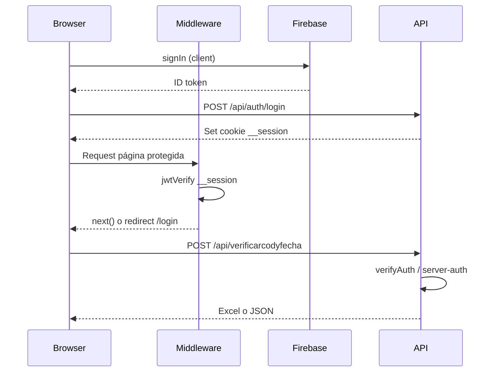

# Especificación — Kaiser DTE (`verificador-dte`)

Visión de producto, dominio fiscal y mapa técnico. Para convenciones de desarrollo y stack, ver [`agent.md`](agent.md).

## Visión

Plataforma web para **verificar documentos tributarios electrónicos (DTE)** emitidos en El Salvador, consultando los portales públicos del Ministerio de Hacienda. Permite validación unitaria y por lotes (CSV, XLSX, JSON, enlaces), generación de reportes Excel, controles por plan de suscripción y herramientas complementarias (extracción JSON, plantillas PDF, calendario tributario, administración de usuarios).

**Público:** despachos contables, empresas con alto volumen de comprobantes, responsables de auditoría y cumplimiento fiscal.

## Dominio DTE (El Salvador)

- **Código de generación:** UUID (`xxxxxxxx-xxxx-xxxx-xxxx-xxxxxxxxxxxx`).
- **Fecha de emisión:** requerida junto al código para la consulta pública.
- **Estados normalizados** (`lib/dteCommon.js` → `normalizarEstado`): `EMITIDO`, `RECHAZADO`, `ANULADO`, `INVALIDADO`, `NO ENCONTRADO`, `DESCONOCIDO`.
- **Tipos DTE** (`normalizarTipoDte`): p. ej. `FACTURA`, `COMPROBANTE DE CRÉDITO FISCAL`, `NOTA DE CRÉDITO`.

### Portales de consulta (scraping)

| Constante | URL |
|-----------|-----|
| `ADMIN` | `https://admin.factura.gob.sv/consultaPublica` |
| `WEBAPP` | `https://webapp.dtes.mh.gob.sv/consultaPublica` |

La consulta automatizada usa **Playwright**. En Vercel/serverless se usa Chromium empaquetado (`@sparticuz/chromium`). Concurrencia configurable por pool de páginas (`procesarFilasConPool`).

### Salidas típicas

- Excel (`.xlsx`) con pestañas según tipo de verificación (`buildWorkbook` en `dteCommon.js`).
- Respuesta JSON con `resultados`, `filename`, `total`.
- Upload opcional a **Vercel Blob** si existe `BLOB_READ_WRITE_TOKEN` (URL de descarga al cliente).

## Flujos principales de verificación

| Flujo | Ruta UI | API | Entrada |
|-------|---------|-----|---------|
| Código + fecha (lote) | `/verificadorDTE/verificarodyfecha` | `POST /api/verificarcodyfecha` | CSV/XLSX: columnas codGen + fecha |
| JSON (lote) | `/verificadorDTE/verificadorjson` | `POST /api/verificararchjson` | JSON DTE: `identificacion.codigoGeneracion`, `identificacion.fecEmi` |
| Export JSON previo | — | `POST /api/verificararchjson/export` | Re-exportar resultados |
| Enlaces DTE | `/verificadorDTE/verificador` | `POST /api/procesaedte` | Lista codGen + fecha (ambiente admin/webapp) |
| Individual | `/verificadorDTE/verificacion_individual` | Consulta en UI + APIs relacionadas | Un documento manual |
| Procesar genérico | `/prrocesardte` | `POST /api/procesar` | Procesamiento batch alternativo |

**Dashboard** (`/dashboard`): accesos directos a los módulos anteriores.

## Otros módulos funcionales

| Módulo | Rutas UI | Notas |
|--------|----------|-------|
| Extracción compras | `/extraer/compras-json` | JSON → datos estructurados |
| Extracción ventas | `/extraer/ventas-json` | |
| Liquidación | `/extraer/liquidacion-json` | |
| Sujetos excluidos | `/extraer/sujetos-excluidos` | |
| QR desde PDF | `/extraer/qr-pdf` | |
| Plantillas PDF | `/plantillas-pdf`, `/plantillas-pdf/generar` | `@react-pdf/renderer` |
| Calendario tributario | `/tributario` | `GET /api/tributario/calendario` |
| Escaneo QR | `/escaneo-qr` | |
| Reportes | `/reportes` | |
| Consultar JSON | `/consultarjson` | |
| Perfil / usuarios | `/profile`, `/usuarios`, `/configuraciones` | |
| SEO público | `/landing`, `/verificacion-dte`, `/facturacion-electronica`, `/consulta-hacienda`, `/auditoria-dte`, `/precios` | |

## Panel de administración

| Ruta | Función |
|------|---------|
| `/admin/users` | Gestión usuarios |
| `/admin/planes` | Planes, precios y cupos de colaboradores |
| `/admin/users` | Usuarios, roles, clientes, colaboradores y cupos delegados |
| `/admin/access-requests` | Redirige a `/admin/users` |
| `/onboarding` | Wizard KYC obligatorio (cliente) |
| `/usuarios` | Gestión de colaboradores (cliente / admin org) |
| `/admin/obligacion` | Obligaciones tributarias |
| `/admin/avisos` | Avisos |
| `/admin/logs` | Logs |
| `/admin/monitoreo/*` | Procesamiento, licencias, inicios de sesión |

APIs admin relevantes: `/api/admin/obligacion`, `/api/admin/smtp`, `/api/planes`, `/api/admin/organizations`, `/api/access-requests/*`, `/api/organization/*`, `/api/users/*`, `/api/login-logs`, `/api/processing-logs`.

## Multi-tenant: organizaciones y roles

### Colección `organizations/{orgId}`

Creada al aprobar una solicitud de acceso (`orgId` = `ownerUid` inicial). Campos principales: `name`, `allowedEmailDomain`, `membershipType`, `maxCollaborators`, `collaboratorCount`, `status`, `kyc` (onboarding fiscal).

### Colección `users/{uid}` — [`AppUser`](lib/firestoreUser.ts)

| Campo | Descripción |
|-------|-------------|
| `email`, `displayName` | Perfil |
| `role` | `superadmin` \| `cliente` \| `colaborador` |
| `organizationId` | Org del cliente y colaboradores |
| `orgRole` | `administrador` \| `miembro` (solo colaboradores) |
| `accountStatus` | `active` \| `inactive` \| `blocked` |
| `membership.type` | `free` \| `premium` \| `pro` |
| `onboardingCompleted` | Cliente completó wizard |
| `mustChangePassword` | Fuerza cambio en primer login |
| `totpEnabled`, `disabled`, `forceLogoutAt` | Seguridad y sesión |

**Matriz de permisos**

| Rol | Gestión org / usuarios | Acceso app |
|-----|------------------------|------------|
| `superadmin` | Todo | Sin gate KYC |
| `cliente` | Admin de su org, dominio, colaboradores | Requiere `kycCompleted` |
| `colaborador` + `orgRole: administrador` | CRUD colaboradores (sin plan/dominio) | Según org activa |
| `colaborador` + `orgRole: miembro` | Uso operativo | Según plan |

**Cupos:** solo cuentan colaboradores; el cliente dueño no ocupa asiento. Límite por tier en `config/plans.maxCollaborators`.

**Flujo:** registro → verificación email → solicitud `pending` → superadmin aprueba → login + cambio clave → `/onboarding` (KYC + dominio) → app desbloqueada → invitación colaboradores `@dominio`.

**Planes:** `allowedRoutes`, `queryLimit` y `maxCollaborators` en `config/plans` (admin `/admin/planes`, API `/api/planes`).

## APIs — inventario por área

### Auth y sesión

- `POST /api/auth/login`, `register`, `reset-password`, `password-reset-code`, `password-reset-verify`
- `POST /api/totp/generate`, `verify`, `validate`, `disable`
- `POST /api/users/save`, `delete`, `session-control`
- `POST /api/login-logs` (GET, DELETE)

### Verificación DTE

- `POST /api/verificarcodyfecha` (GET health)
- `POST /api/verificararchjson`, `/export`
- `POST /api/procesaedte`, `/api/procesar`

### Desktop / licencias

- `POST /api/desktop/auth/login`, `quick-login`, `update-password`
- `GET|POST|DELETE /api/desktop/licenses`
- `POST /api/desktop/processing-logs`

### Utilidades

- `GET /api/archivos/descargar`
- `GET|POST /api/notifications`, `POST /api/notifications/read`
- `GET|POST /api/organization/me`, `onboarding`, `users`, `users/[uid]`, `reset-password`
- `GET|PATCH /api/admin/organizations`, `.../collaborators`
- `GET /api/tributario/calendario`
- `POST /api/access-requests`, `verify`, `approve`, `reject`
- ~~`POST /api/empleados`~~ (deprecado → `POST /api/organization/users`)

## Autenticación (flujo resumido)

## Personalización visual

La tipografía de toda la aplicación se configura con una sola variable de entorno:

- `NEXT_PUBLIC_GOOGLE_FONTS_URL` — enlace al CSS de Google Fonts (formato css2).
- Ejemplo: `https://fonts.googleapis.com/css2?family=Inter:wght@400;500;600;700&display=swap`
- La familia tipográfica se deriva automáticamente del parámetro `family=` (ver `lib/fonts/app-font.ts`).
- Sin URL válida: fuentes del sistema (`ui-sans-serif`, `system-ui`).

## Variables de entorno (referencia)

Sin valores reales en el repositorio.

| Variable | Uso |
|----------|-----|
| `NEXT_PUBLIC_GOOGLE_FONTS_URL` | CSS de Google Fonts; familia extraída automáticamente |
| `NEXT_PUBLIC_FIREBASE_*` | Config cliente Firebase |
| `FIREBASE_SERVICE_ACCOUNT_JSON` | Admin SDK (servidor) |
| `JWT_SECRET` | Tokens desktop / sesión API |
| `TOTP_ENCRYPTION_KEY` | Cifrado secretos TOTP |
| `BLOB_READ_WRITE_TOKEN` | Vercel Blob para exports |
| `NEXT_PUBLIC_APP_URL`, `APP_URL`, `VERCEL_URL` | URLs base emails/enlaces |
| `VERCEL` | Detectar entorno serverless (Chromium) |

## Despliegue y seguridad

- **Hosting:** Vercel.
- **Headers:** CSP, HSTS, X-Frame-Options en [`next.config.ts`](next.config.ts).
- **Build:** `eslint.ignoreDuringBuilds: true` (conocido).
- **Sitemap:** `postbuild` → `next-sitemap`.
- **APK móvil:** en Firebase Storage; enlace en dashboard (`public/apk` ignorado en git excepto estructura).

## Integraciones externas

- Firebase (Auth, Firestore, Storage)
- Google APIs (`googleapis`) — según feature
- Ministerio de Hacienda — consulta pública vía browser automation
- Vercel Blob — almacenamiento temporal de reportes
- Nodemailer — correos (`lib/server-mail.ts`)

## Glosario

| Término | Significado |
|---------|-------------|
| DTE | Documento Tributario Electrónico |
| codGen | Código de generación (UUID del DTE) |
| MH / Hacienda | Ministerio de Hacienda de El Salvador |
| Lote | Verificación masiva vía archivo o lista |
